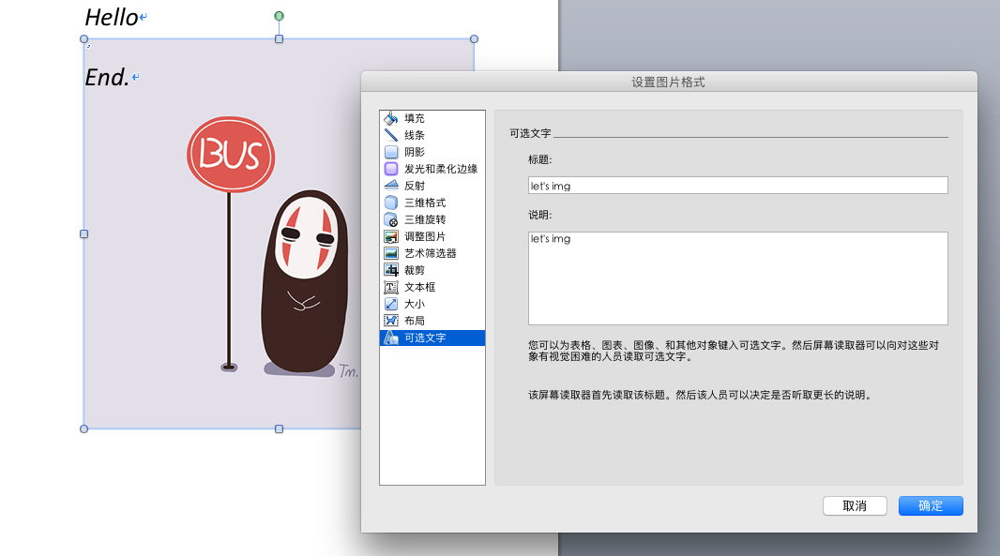

= poi-tl
Sayi 卅一 <adasai90@gmail.com>
v1.6.0
:description: word模板引擎
:keywords: poi,word,docx,template,模板
:doctype: book
:encoding: utf-8
:lang: en
:toc: left
:icons: font
:source-highlighter: prettify
:numbered:
:nofooter:
:sectlinks:
:sectanchors:

[example]
--
关于文档：v1.6.x并非最新版本，推荐使用poi-tl最新版本：link:http://deepoove.com/poi-tl[poi-tl 最新文档, window=_blank]。
--

poi-tl（poi template language）是基于Apache POI的Word模板引擎，纯Java组件，跨平台，代码短小精悍，通过插件机制使其具有高度扩展性。

CAUTION: 在文档的任何地方做任何事情（_Do Anything Anywhere_）是poi-tl的星辰大海。

== Requirements
* Apache poi4.0.0+
* JDK1.8+

Apache poi已经进入4.0.0+时代，如果你仍希望使用低版本的Apache poi(3.16+)，请查阅poi-tl link:http://deepoove.com/poi-tl/1.5.x/[v1.5.x 文档, window=_blank]。

== Maven
[source, xml]
----
<dependency>
  <groupId>com.deepoove</groupId>
  <artifactId>poi-tl</artifactId>
  <version>1.6.0</version>
</dependency>
----

== Gradle 
[source, groovy]
compile group: 'com.deepoove', name: 'poi-tl', version: '1.6.0'

== 快速开始
=== 2min入门
新建Word模板template.docx，包含内容{{title}}
[example]
{{title}}

[sidebar]
.代码示例
--
[source, java]
----
XWPFTemplate template = XWPFTemplate.compile("~/template.docx").render(new HashMap<String, Object>(){{ <1> <2>
        put("title", "Poi-tl 模板引擎");
}});
FileOutputStream out = new FileOutputStream("out_template.docx");
template.write(out); <3>
out.flush();
out.close();
template.close();
----
<1> 编译模板
<2> 渲染数据
<3> 输出到流

*TDO模式：Template + data-model = output*
--

=== Template：模板
Word模板支持DOCX格式，所有的标签都是以 `{{` 开头，以 `}}` 结尾，模板标签可以出现在任何非文本框的位置，包括页眉，页脚，表格内部等等。

IMPORTANT: 表格布局可以设计出很多优秀专业的文档，模板文档请使用表格布局，不支持文本框。

poi-tl深知**“所见即所得”**的道理，文本的样式继承模板标签的样式，即如果模板标签{{title}}是蓝色微软雅黑加粗四号字体，则替换后的文本也是蓝色微软雅黑加粗四号字体。

image::.././style.png[align='center'] 

**“所见即所得”**也体现在图片上，如果模板中是一个长200宽300布局样式为衬于文字下方的占位图片，那么替换后的图片样式也保持不变。

=== Data-Model：数据模型
如果模板标签定义了"anywhere"，那么数据模型定义的就是"anything"。

我们需要指定每个模板标签对应的数据模型，它可以是一个Map，其中key是标签名称：
[source, java]
----
Map<String, Object> args = new HashMap<>();
args.put("name", "Sayi");
args.put("start_time", "2019-08-04");
----

可以是一个对象，属性名称是标签名称(可以通过注解@Name设置标签名称):
[source, java]
----
public class MyDataModel {

  // 对应模板标签{{name}}
  private String name;

  // 对应模板标签{{start_time}}
  @Name("start_time")
  private String startTime;

  // 对应模板标签{{author.XXX}},XXX是Author的属性名
  private Author author;

}
----

如上所示，poi-tl模板标签支持对象点缀式表达式，比如{{author.name}}的模板标签对应的数据是author对象的name属性值。

TIP: 如果可以强大，就没有必要选择平庸，poi-tl的模板标签完美的支持Spring Expression Language，甚至可以执行标签中的Java代码，请参见poi-tl的EL表达式配置。

poi-tl内置了若干数据模型，使用这些类型的数据，可以在模板标签位置提供更丰富的操作，这些数据模型都实现了接口 `public interface RenderData {}`：

* TextRenderData、HyperLinkTextRenderData
* PictureRenderData
* MiniTableRenderData
* NumbericRenderData
* DocxRenderData

=== output：流
可以将最终结果渲染到任意输出流中，比如输出到文件流FileOutputStream生成新文档，输出到网络流ServletOutputStream供浏览器下载。

[source, java]
----
// 输出到任何流
template.write(OutputStream stream)

// 便捷的输出到文件
template.writeToFile(String path)
----

== 语法
poi-tl內建了五种模板。

=== 文本模板{{var}}
[example]
{{var}}

`TextRenderData` 或 `String` 数据模型。

[sidebar]
.代码示例
--
[source, java]
put("author", new TextRenderData("000000", "Sayi卅一"));
put("introduce", "http://www.deepoove.com");
put("link", new HyperLinkTextRenderData("website.", "http://www.deepoove.com"));
--

除了所见即所得的继承模板标签样式，也提供了通过代码设定文本样式的方式。

[sidebar]
.`TextRenderData` 的结构体
--
[source, json]
----
{
  "text": "Sayi",
  "style": {
    "strike": false, <1>
    "bold": true, <2>
    "italic": false, <3>
    "color": "00FF00", <4>
    "underLine": false, <5>
    "fontFamily": "微软雅黑", <6>
    "fontSize": 12, <7>
    "highlightColor": "green" <8>
  }
}
----
<1> 删除线
<2> 粗体
<3> 斜体
<4> 颜色
<5> 下划线
<6> 字体
<7> 字号
<8> 背景高亮色

注：HyperLinkTextRenderData继承于TextRenderData，实现了超链接文本的功能。
--
NOTE: 结构体只是数据模型的可视化展示，数据模型不是文本型的，而是Java对象。下文中出现的所有结构体也都如此。

TIP: 文本换行使用 `\n` 字符。

=== 图片模板{{@var}}
[example]
{{@var}}

`PictureRenderData` 数据模型。

[sidebar]
.代码示例
--
[source, java]
----
// 本地图片
put("localPicture", new PictureRenderData(120, 120, "./sayi.png"));

// 图片流文件
put("localBytePicture", new PictureRenderData(100, 120, ".png", new FileInputStream("./logo.png")));

// 网络图片 
put("urlPicture", new PictureRenderData(100, 100, ".png", BytePictureUtils.getUrlBufferedImage("https://avatars3.githubusercontent.com/u/1394854")));

// java 图片
put("bufferImagePicture", new PictureRenderData(100, 120, ".png", bufferImage)));
----
--
可以指定图片的宽度和高度，也支持 `BufferedImage`，这样我们可以利用Java生成任意图表插入到word文档中。

[sidebar]
.`PictureRenderData` 的结构体
--
[source, json]
----
{
  "path": "", <1>
  "data": [], <2>
  "altMeta": "图片不存在", <3>
  "width": 100, <4>
  "height": 100 <5>
}
----
<1> 图片路径
<2> 图片也可以是byte[]字节数组
<3> 当无法获取图片时展示的文字
<4> 宽度
<5> 高度
--

=== 表格模板{{#var}}
[example]
{{#var}}

poi-tl默认实现了N行N列的样式(如下图)，同时提供了当数据为空时，展示一行空数据的文案(如下图中的No Data Descs)，数据模型是 `MiniTableRenderData` 。

image::.././table0.png[align='center']

[sidebar]
.`MiniTableRenderData` 的结构体
--
[source, json]
----
{
  "rowDatas": [ <1>
    {
      "cellDatas": [ <2>
        {
          "renderData": [TextRenderData],
          "cellStyle": { <3>
            "align": "center", 
            "backgroundColor": "ff9800"
          }
        }
      ],
      "rowStyle": { <4>
        "align": "center", 
        "backgroundColor": "ff9800"
      }
    }
  ],
  "header": { <5>
    "cellDatas": [
      {
        "renderData": [TextRenderData],
        "cellStyle": { 
          "align": "center", 
          "backgroundColor": "ff9800"
        }
      }
    ],
    "rowStyle": { <4>
      "align": "center", 
      "backgroundColor": "ff9800"
    }
  },
  "noDatadesc": "No Data Desc", <6>
  "style": { <7>
      "align": "center"
    }
  "width": 14.65 <8>
}
----
<1> 定义表格数据
<2> 定义单元格数据，数据由 `TextRenderData` 指定
<3> 单元格样式：对齐方式，背景色
<4> 行样式：行数据的对齐方式，行背景色
<5> 定义表格头
<6> 没有数据的展示文案
<7> 表格样式：表格居左、居中、居右对齐
<8> 表格宽度，单位cm
--

[sidebar]
.代码示例
--
[source, java]
----
RowRenderData header = RowRenderData.build(new TextRenderData("FFFFFF", "姓名"), new TextRenderData("FFFFFF", "学历"));

RowRenderData row0 = RowRenderData.build("张三", "研究生");
RowRenderData row1 = RowRenderData.build("李四", "博士");
RowRenderData row2 = RowRenderData.build("王五", "博士后");

put("table", new MiniTableRenderData(header, Arrays.asList(row0, row1, row2)));
----
--

NOTE: 表格的宽度(单位CM)怎么定义的: 页面宽度 - 页边距宽度 * 2 = 表格的最大宽度。
页面宽度为A4(20.99 * 29.6，页边距为3.17 * 2.54)的文档最大表格宽度14.65CM。可以根据需要指定表格宽度。

需求的丰富多彩往往是默认表格样式无法满足的，我们通常会遇到以下两个场景：

*场景一*： 完全由自己掌控整个表格的生成：参见link:#cus-policy-section[插件-开发一个插件]。

*场景二*： 在一个已有的表格中，动态处理某些单元格数据：提供了抽象表格策略DynamicTableRenderPolicy或者引用渲染策略插件OptionalTextTableRefRenderPolicy，参见link:#example-table[示例-付款通知书]。

=== 列表模板{{*var}}
[example]
{{*var}}

`NumbericRenderData` 数据模型。
[sidebar]
.代码示例
--
[source, java]
----
put("feature", new NumbericRenderData(new ArrayList<TextRenderData>() {
  {
    add(new TextRenderData("Plug-in grammar"));
    add(new TextRenderData("Supports word text, header..."));
    add(new TextRenderData("Not just templates, but also style templates"));
  }
}));
----
--
列表样式支持罗马字符、有序无序等。参见NumbericRenderData.FMT_*。
[source]
FMT_DECIMAL //1. 2. 3.
FMT_DECIMAL_PARENTHESES //1) 2) 3)
FMT_BULLET //● ● ●
FMT_LOWER_LETTER //a. b. c.
FMT_LOWER_ROMAN //i ⅱ ⅲ
FMT_UPPER_LETTER //A. B. C.

=== 文档模板{{+var}}
[example]
{{+var}}

`DocxRenderData` 数据模型，可以是另一个docx文档的合并，或者是数据集合针对同一个docx模板文档的循环渲染结果的合并。
[sidebar]
.代码示例
--
[source, java]
----
List<SegmentData> segments = new ArrayList<SegmentData>();
SegmentData s1 = new SegmentData();
s1.setTitle("经常抱怨的自己");
s1.setContent("每个人生活得都不容易，经常向别人抱怨的人，说白了就是把对方当做“垃圾场”，你一股脑地将自己的埋怨与不满倒给别人，自己倒是爽了，你有考虑过对方的感受吗？对方的脸上可能一笑了之，但是心里可能有一万只草泥马奔腾而过。");
segments.add(s1);

SegmentData s2 = new SegmentData();
s2.setTitle("拖拖拉拉的自己");
s2.setContent("能够今天做完的事情，不要拖到明天，你的事情没有任何人有义务去帮你做；不要做“宅男”、不要当“宅女”，放假的日子约上三五好友出去转转；经常动手做家务，既能分担伴侣的负担，又有一个干净舒适的环境何乐而不为呢？");
segments.add(s2);

put("docx_word", new DocxRenderData(new File("~/segment.docx"), segments)); <1> <2>
----
<1> 主模板包含标签{{+docx_word}}
<2> segment.docx是一个包含了{{title}}和{{content}}的待合并模板，使用segments集合数据渲染后合并到主模板
--
参见link:#example-article[示例-一篇文章]

== 配置
poi-tl提供了配置类 `Configure` 和它的构建器类 `ConfigureBuilder`，
配置的使用方式如下：
[source, java]
ConfigureBuilder builder = Configure.newBuilder();
XWPFTemplate.compile("~/template.docx", builder.buid());

=== 语法前后缀
如果你不喜欢 `{{}}` 的方式，更偏爱freemarker `${}` 的方式：
[source, java]
----
builder.buildGramer("${", "}");
----

=== 自定义语法
默认的图片模板语法是{{@var}}，如果我们希望使用新语法{{%var}}作为图片模板：
[source, java]
builder.addPlugin('%', new PictureRenderPolicy());

高度扩展性体现在连自己的默认语法都可以任意更改：
[source, java]
builder.addPlugin('@', new MiniTableRenderPolicy());
builder.addPlugin('#', new PictureRenderPolicy());

这样{{@var}}就变成了表格模板，{{#var}}变成了图片模板，虽然不建议改变內建模板语法，但是从中可以看到poi-tl插件的设计思想，深藏功与名。

=== 标签规则
模板标签支持中文、字母、数字、下划线的组合，比如{{客户手机号}}，我们可以通过正则表达式来配置标签的规则，比如不允许中文：
[source, java]
builder.buildGrammerRegex("[\\w]+(\\.[\\w]+)*");

=== 静默行为
poi-tl在模板标签表达式无法计算结果时默认会认为标签对应的数据为null，当标签对应的数据为null或者不合法时，模板标签默认会被清空而不是保留，这种行为被称为静默模式，我们可以通过配置来改变这种行为。

一个模板标签表达式的结果无法被计算的时候，可以通过ElMode来配置行为：
[source, java]
----
// 默认行为，EL静默模式，表达式计算错误的情况下结果置为null
builder.setElMode(ELMode.POI_TL_STANDARD_MODE);
// 严格EL模式，表达式计算错误的情况下抛出异常，这种情况下要求表达式必须可被计算
builder.setElMode(ELMode.POI_TL_STICT_MODE);
----

模板标签表达式找不到对应数据、计算结果为null或者数据不合法的时候，可以配置模板标签的行为：
[source, java]
----
// 默认行为，静默删除文档中该标签
builder.setValidErrorHandler(new ClearHandler());
// 什么都不做，文档中保留该标签
builder.setValidErrorHandler(new DiscardHandler());
// 中断执行，抛出异常
builder.setValidErrorHandler(new AbortHandler());
----

NOTE: 所有行为都是基于接口设计，可完美扩展。

=== SpingEL表达式
Spring Expression Language (SpEL)是一个强大的表达式语言，支持在运行时查询和操作对象图。在使用SpEL前需要引入相应的依赖：
[source, xml]
----
<dependency>
  <groupId>org.springframework</groupId>
  <artifactId>spring-expression</artifactId>
  <version>4.3.6.RELEASE</version>
</dependency>
----

poi-tl的表达式模板支持切换到SpEL模式：
[source, java]
----
builder.setElMode(ELMode.SPEL_MODE);
----
关于SpEL的写法可以参见官网，下面给出一些典型的示例。
[example]
--
[source]
----
{{name}}
{{name.toUpperCase()}} <1>
{{empty?:'这个字段为空'}}
{{sex ? '男' : '女'}} <2>
{{new java.text.SimpleDateFormat('yyyy-MM-dd HH:mm:ss').format(time)}} <3>
{{new java.text.SimpleDateFormat('yyyy-MM-dd hh:mm').format(time)}}
{{price/10000 + '万元'}} <4>
{{dogs[0].name}} <5>
{{dogs[0].age}}
----
<1> 方法调用
<2> 三目运算符
<3> 方法调用
<4> 运算符
<5> 数组列表
--

TIP: poi-tl提供了表达式计算接口 `RenderDataCompute`，支持扩展任何的表达式引擎，SpEL模式是通过 `SpELRenderDataCompute` 实现。

=== 模板生成模板
模板引擎不仅仅可以生成文档，也可以生成新的模板，比如我们想构造这样的新模板：把原先的一个模板标签分成两个模板标签：

[source, java]
put("title", "{{title}}\n{{subtitle}}");

=== 日志
poi-tl使用slf4j作为日志门面，你可以自由选择日志实现，比如logback、log4j等。我们以logback为例：

首先在项目中添加logback依赖：
[source, xml]
----
<dependency>
  <groupId>ch.qos.logback</groupId>
  <artifactId>logback-core</artifactId>
  <version>1.2.3</version>
</dependency>
<dependency>
  <groupId>ch.qos.logback</groupId>
  <artifactId>logback-classic</artifactId>
  <version>1.2.3</version>
</dependency>
----

然后配置logback.xml文件，可以配置日志级别和格式：
[source, xml]
----
<?xml version="1.0" encoding="UTF-8"?>
<configuration>
  <appender name="STDOUT" class="ch.qos.logback.core.ConsoleAppender">
    <encoder>
      <pattern>%d{HH:mm:ss.SSS} [%thread] %-5level %logger{36} - %msg%n</pattern>
    </encoder>
  </appender>

  <logger name="com.deepoove.poi" level="debug" additivity="false">
    <appender-ref ref="STDOUT" />
  </logger>
  <root level="info">
    <appender-ref ref="STDOUT" />
  </root>
</configuration>
----

debug级别的日志会打印解析渲染过程中的信息，有利于程序调试，另外在模板引擎执行结束后会打印耗时信息：
[example]
--
Successfully Render the template file in 13 millis
--

== 插件

*插件是poi-tl的核心*，插件的核心逻辑是在模板的基础上通过poi-tl和poi提供的API操作word文档，从而抵达 _Do Anything Anywhere_ 的星辰大海。

CAUTION: 由于需要操作Word文档，我们需要掌握一些Apache POI API的知识，可以参见Apache官方API，这里也有一个快速入门的教程：link:http://deepoove.com/poi-tl/apache-poi-guide.html[Apache POI Word(docx) 入门示例教程]。

=== 原生插件
poi-tl默认提供了五个策略插件，用来处理文本、图片、列表、表格、文档合并等：

* TextRenderPolicy
* PictureRenderPolicy
* NumbericRenderPolicy
* MiniTableRenderPolicy
* DocxRenderPolicy

由于这五个插件如此通用，因此将这些插件注册为语法，从而搭建了poi-tl的五大內建模板语法，也构筑了poi-tl高度自由的语法插件体系。

[[cus-policy-section]]
=== 开发一个插件
一个插件的实现就是要告诉我们在模板的某个地方用某些数据做某些事情，我们可以通过实现 `RenderPolicy` 接口开发自己的渲染策略：
[source, java]
----
public interface RenderPolicy {
  void render(ElementTemplate eleTemplate, Object data, XWPFTemplate template); <1> <2> <3>
}
----
<1> ElementTemplate是当前模板标签所在位置
<2> data是数据模型
<3> 通过XWPFTemplate获得Apache POI增强类NiceXWPFDocument，继而可以在当前模板标签位置插入段落，图片，表格等

按照行业习俗，我们先写一个Hello, world插件：
[example]
--
[source, java]
----
public class HelloWorldRenderPolicy implements RenderPolicy {

  @Override
  public void render(ElementTemplate eleTemplate, Object data, XWPFTemplate template) {
    XWPFRun run = ((RunTemplate) eleTemplate).getRun(); <1>
    // String thing = String.valueOf(data);
    String thing = "Hello, world";
    run.setText(thing, 0); <2>
  }

}
----
<1> 当前位置XWPFRun
<2> 渲染文本hello, world
--

poi-tl提供了抽象模板类 `AbstractRenderPolicy` ，它定义了一些骨架步骤并且将数据模型的校验和渲染逻辑分开，使用泛型约束数据类型，让插件开发起来更简单，我们再来看看Hello, world插件的写法：
[example]
--
[source, java]
----
public class HelloWorldRenderPolicy extends AbstractRenderPolicy<String> {

  @Override
  public void doRender(RenderContext<String> context) throws Exception {
    // anywhere delegate <1>
    WhereDelegate where = context.getWhereDelegate();
    // any thing
    //String thing = context.getThing();
    String thing = "Hello, world";
    // do
    where.renderText(thing);
  }

}
----
<1> WhereDelegate对当前位置的委托，封装了操作当前位置的一些便捷方法
--

接下来我们再写一个更复杂的插件，在模板标签位置完完全全使用代码创建一个表格，这样我们就可以随心所欲的操作表格：
[example]
--
[source, java]
----
public class CustomTableRenderPolicy extends AbstractRenderPolicy<Object> {

  @Override
  protected void afterRender(RenderContext<Object> context) {
    // 清空模板标签
    clearPlaceholder(context, true);
  }

  @Override
  public void doRender(RenderContext<Object> context)
      throws Exception {

    NiceXWPFDocument doc = context.getXWPFDocument();
    XWPFRun run = context.getRun();
    // 定义行列
    int row = 10, col = 8;
    // 插入表格
    XWPFTable table = doc.insertNewTable(run, row, col);

    // 定义表格宽度、边框和样式
    TableTools.widthTable(table, MiniTableRenderData.WIDTH_A4_FULL, col);
    TableTools.borderTable(table, 4);

    // TODO 调用XWPFTable API操作表格：data对象可以包含任意你想要的数据，包括图片文本等
    // TODO 调用MiniTableRenderPolicy.Helper.renderRow方法快速方便的渲染一行数据
    // TODO 调用TableTools类方法操作表格，比如合并单元格
    // ......
    TableTools.mergeCellsHorizonal(table, 0, 0, 7);
    TableTools.mergeCellsVertically(table, 0, 1, 9);
    
  }
}
----
CustomTableRenderPolicy通过 `doc.insertNewTable()` 在当前模板位置插入表格，使用XWPFTable API来操作表格。
--
NOTE: 原则上Apache POI支持的操作，都可以在当前模板位置进行渲染。

=== 将插件应用到模板
当我们有个模板标签为{{report}}，如果希望在这个位置做些不一样或者更复杂的事情，我们可以将插件应用到这个模板标签：
[source, java]
ConfigureBuilder builder = Configure.newBuilder();
builder.bind("report", new CustomTableRenderPolicy());

ConfigureBuilder采用了链式调用的方式，可以一次性设置多个模板的插件：
[source, java]
builder.bind("report", new CustomTableRenderPolicy())
    bind("name", new MyRenderPolicy());

=== 将插件注册为语法
当我们的插件具有一定的通用能力就可以将其注册为语法。比如增加%语法：{{%var}}，对应自定义的渲染策略 `HelloWorldRenderPolicy`：
[source, java]
builder.addPlugin('%', new HelloWorldRenderPolicy());

=== 辅助类Helper
在內建策略插件中，通常会提供一个静态Helper辅助类，在我们实现自己的RenderPolicy时，也可以通过这些辅助类操作文档。
[source, java]
----
// 某个位置渲染文本
TextRenderPolicy.Helper.renderTextRun(XWPFRun, Object);
// 某个位置渲染图片
PictureRenderPolicy.Helper.renderPicture(XWPFRun, PictureRenderData);
// 某个位置渲染列表
NumbericRenderPolicy.Helper.renderNumberic(XWPFRun, NumbericRenderData);
// 渲染表格的一行数据
MiniTableRenderPolicy.Helper.renderRow(XWPFTable, int, RowRenderData);
// 渲染单元格
MiniTableRenderPolicy.Helper.renderCell(XWPFTableCell, CellRenderData, TableStyle)
----

=== Plugin Code Example
我想用一个完整的代码示例向你展示 _Do Anything Anywhere_ 的想法，它不使用任何poi-tl的默认插件，完全使用匿名类创建新插件完成。

插件可以看成是一个函数，它的入参是anywhere和anything，函数体就是do something。

[example]
--
[source, java]
----
// where绑定policy
Configure config = Configure.newBuilder().bind("sea", new AbstractRenderPolicy<String>() { <1>
  @Override
  public void doRender(RenderContext<String> context) throws Exception {
    // anywhere
    XWPFRun where = context.getWhere();
    // anything
    String thing = context.getThing();
    // do 文本
    where.setText(thing, 0);
  }
}).bind("sea_img", new AbstractRenderPolicy<String>() { <2>
  @Override
  public void doRender(RenderContext<String> context) throws Exception {
    // anywhere delegate
    WhereDelegate where = context.getWhereDelegate();
    // any thing
    String thing = context.getThing();
    // do 图片
    FileInputStream stream = null;
    try {
      stream = new FileInputStream(thing);
      where.addPicture(stream, XWPFDocument.PICTURE_TYPE_JPEG, 500, 300);
    }
    finally {
      IOUtils.closeQuietly(stream);
    }
    // clear
    clearPlaceholder(context, false);
  }
}).bind("sea_feature", new AbstractRenderPolicy<List<String>>() { <3>
  @Override
  public void doRender(RenderContext<List<String>> context) throws Exception {
    // anywhere delegate
    WhereDelegate where = context.getWhereDelegate();
    // anything
    List<String> thing = context.getThing();
    // do 列表
    where.renderNumberic(NumbericRenderData.build(thing.toArray(new String[] {})));
    // clear
    clearPlaceholder(context, true);
  }
}).build();

// 初始化where的数据
HashMap<String, Object> args = new HashMap<String, Object>();
args.put("sea", "Hello, world!");
args.put("sea_img", "src/test/resources/sea.jpg");
args.put("sea_feature", Arrays.asList("面朝大海春暖花开", "今朝有酒今朝醉"));
args.put("sea_location", Arrays.asList("日落：日落山花红四海", "花海：你想要的都在这里"));

// 一行代码
XWPFTemplate.compile("src/test/resources/sea.docx", config).render(args)
    .writeToFile("out_sea.docx");

----
<1> 自定义文本插件
<2> 自定义图片插件
<3> 自定义列表插件
--

=== 引用渲染策略插件
对于文档中的元素(元素包括不限于表格、图片)，很多时候我们只想改变它的一点点属性，比如对于一个模板中布局好的图片我们只想替换图片内容，普通的渲染策略如果做到这一点可能需要重新创建整个图片，然后再设置期望的布局...

引用渲染策略ReferenceRenderPolicy就这样诞生了，它提供了直接引用文档中的元素句柄的能力，**这个重要的特性在我们只想改变文档中某个元素极小一部分样式和属性的时候特别有用，因为其余样式和属性都可以在模板中预置好，真正的所见即所得**。
[source,java]
----
public abstract class ReferenceRenderPolicy<T> {

  /**
   * 定位引用对象
   * 
   * @param template
   * @return
   */
  protected abstract T locate(XWPFTemplate template);

  /**
   * 操作引用对象
   * 
   * @param t
   *      引用对象
   * @param template
   *      模板
   */
  public abstract void doRender(T t, XWPFTemplate template) throws Exception;
}
----
locate抽象方法是用来定位具体的文档元素的，这个方法的实现充满了想象空间。poi-tl默认提供了两种方式：一种是通过元素在文档的位置，一种是匹配元素的可选文字，推荐使用可选文字引用元素。

我们以poi-tl内置的引用渲染策略插件 `ReplaceOptionalTextPictureRefRenderPolicy` 为例，演示下如何使用可选文字引用渲染策略替换一个占位图片。

[example]
--
首先在模板中，任意设置图片布局和格式(比如衬于文字下方)，可选文字在标题或说明中填写"let's img"(文字内容没有任何要求，可以输入任何字符)

接下来就可以绑定引用渲染策略替换图片了：
[source, java]
----
Configure configure = Configure.newBuilder()
    .referencePolicy(new ReplaceOptionalTextPictureRefRenderPolicy("let's img", <1> <2>
        new FileInputStream("sayi.png"),
        XWPFDocument.PICTURE_TYPE_PNG))
    .build();
XWPFTemplate template = XWPFTemplate.compile("template.docx", configure)
    .render(new HashMap<>());

template.writeToFile("out.docx");
----
<1> 通过配置类的referencePolicy方法绑定引用渲染策略
<2> "let's img"为匹配文字，优先匹配标题，再匹配说明文字

最终运行的结果是图片布局格式皆不变，只把图片替换成了另一个图片。
--

=== 可选插件列表

除了五个通用的策略插件外，还内置了一些额外用途的插件。

* `DynamicTableRenderPolicy`
动态表格插件，允许直接操作表格对象，功能和 `OptionalTextTableRefRenderPolicy` 相似
* `ListRenderPolicy`
集合插件，允许同时渲染多个文本、图片、表格、列表等。
* `SelfRenderPolicy`
自渲染插件，使用模板标签本身渲染模板
* `IndexRefRenderPolicy`
引用渲染策略插件，定位方式是元素在文档中的位置
* `OptionalTextPictureRefRenderPolicy`
引用渲染策略插件，定位图片方式是图片的可选文字
* `OptionalTextTableRefRenderPolicy`
引用渲染策略插件，定位表格方式是表格的可选文字
* `ReplaceIndexPictureRefRenderPolicy`
引用渲染策略插件，通过图片位置引用图片元素后替换图片
* `ReplaceOptionalTextPictureRefRenderPolicy`
引用渲染策略插件，通过可选文字引用图片元素后替换图片

NOTE: 如果你写了一个不错的插件，欢迎提交Pull Request。

== 示例
接下来的示例采取三段式output+template+data-model来说明，首先直接展示生成后的文档，然后一览模板的样子，最后我们对数据模型做个介绍。

=== 软件说明文档
[example]
--
.output
需要生成这样的一份软件说明书：拥有封面和页眉，正文含有不同样式的文本，还有表格，列表和图片。下载最终生成的文件link:example/poi_tl.docx[poi_tl.docx]

image::../example/example_poitl_output.png[align='center']
--

[example]
--
.template
使用poi-tl语法制作模板，可以看到模板标签不仅仅是模板，同样也是样式标签。

image::../example/example_poitl_template.png[align='center']
--

这个示例向我们展示了poi-tl最基本的能力，它在模板标签位置，插入基本的数据模型。同时也向我们展示了无需编码设置样式：模板，不仅仅是标签模板还是样式模板，所见即所得。

NOTE: 源码参见 link:https://github.com/Sayi/poi-tl/blob/master/src/test/java/com/deepoove/poi/tl/XWPFTemplateTest.java[Junit XWPFTemplateTest]

[[example-table]]
=== 付款通知书
[example]
--
.output
需要生成这样的一份流行的通知书：大部分数据是由表格构成的，需要创建一个订单的表格，还需要在一个已有表格中，填充货物明细和人工费数据。下载最终生成的文件link:example/payment.docx[payment.docx]

image::../example/example_payment_output.png[align='center']
--

[example]
--
.template
使用{{#order}}生成poi-tl提供的默认样式的表格，设置{{detail_table}}为自定义模板渲染策略(继承抽象表格策略DynamicTableRenderPolicy)，自定义已有表格中部分单元格的渲染。

image::../example/example_payment_template.png[align='center']
--

这个示例向我们展示了poi-tl在表格操作上的一些思考。示例中货物明细和人工费的表格就是一个相当复杂的表格，货物明细是由7列组成，行数不定，人工费是由4列组成，行数不定。

默认表格数据模型(MiniTableRenderData)实现了最基本的样式，当需求中的表格更加复杂的时候，我们完全可以设计好那些固定的部分，将需要动态渲染的部分单元格交给自定义模板渲染策略。

poi-tl提供了抽象表格策略DynamicTableRenderPolicy来实现这样的功能，{{detail_table}}标签可以在表格内的任意单元格内，DynamicTableRenderPolicy会获取XWPFTable对象进而获得操作整个表格的能力。
[source, java]
----
public abstract class DynamicTableRenderPolicy implements RenderPolicy {
  public abstract void render(XWPFTable table, Object data);
}
----

新建渲染策略DetailTablePolicy，继承于抽象表格策略。
[source, java]
----
public class DetailTablePolicy extends DynamicTableRenderPolicy {

  // 货品填充数据所在行数
  int goodsStartRow = 2;
  // 人工费填充数据所在行数
  int laborsStartRow = 5;

  @Override
  public void render(XWPFTable table, Object data) {
    if (null == data) return;
    DetailData detailData = (DetailData) data;

    // 人工费循环渲染
    List<RowRenderData> labors = detailData.getLabors();
    if (null != labors) {
      table.removeRow(laborsStartRow);
      // 循环插入行
      for (int i = 0; i < labors.size(); i++) {
        XWPFTableRow insertNewTableRow = table.insertNewTableRow(laborsStartRow);
        for (int j = 0; j < 7; j++) insertNewTableRow.createCell();

        // 合并单元格
        TableTools.mergeCellsHorizonal(table, laborsStartRow, 0, 3);
        // 渲染单行人工费数据
        MiniTableRenderPolicy.Helper.renderRow(table, laborsStartRow, labors.get(i));
      }
    }

    // 货品明细
    List<RowRenderData> goods = detailData.getGoods();
    if (null != goods) {
      table.removeRow(goodsStartRow);
      for (int i = 0; i < goods.size(); i++) {
        XWPFTableRow insertNewTableRow = table.insertNewTableRow(goodsStartRow);
        for (int j = 0; j < 7; j++) insertNewTableRow.createCell();
        // 渲染单行货品明细数据
        MiniTableRenderPolicy.Helper.renderRow(table, goodsStartRow, goods.get(i));
      }
    }
  }
}
----

将模板标签{{detail_table}}设置成此策略。
[source, java]
Configure config = Configure.newBuilder().bind("detail_table", new DetailTablePolicy()).build();

`OptionalTextTableRefRenderPolicy` 引用渲染策略也可以实现 `DynamicTableRenderPolicy` 同样的功能，它通过匹配可选文字引用XWPFTable对象进而操作整个表格。

NOTE: 源码参见 link:https://github.com/Sayi/poi-tl/blob/master/src/test/java/com/deepoove/poi/tl/example/PaymentExample.java[Junit PaymentExample]

[[example-article]]
=== 一篇文章
[example]
--
.output
需要生成这样的一系列文章：除了标题作者之外，它的内容是有规律的，内容是由一行蓝色的标题，一段文字，一张图片构成。下载最终生成的文件link:example/story.docx[story.docx]

image::../example/example_story_output.png[align='center']
--

[example]
--
.template
文章的内容是个典型的文档模板类型，我们制作一个待合并的文档模板segment.docx(下图右侧)，主模板story.docx看起来很简单，其中{{+segment}}标签将会被文档模板循环合并。

image::../example/example_story_template.png[align='center']
--

这个示例充分展示了poi-tl的文档模板和循环功能。当有一段固定样式的段落，根据集合数据循环填充后展示。示例中标题+文字+图片就是这样的可重复段落。

基本原理是后台提供数据模型的集合，不断渲染segment.docx，将渲染结果合并到story.docx文档中。

NOTE: 源码参见 link:https://github.com/Sayi/poi-tl/blob/master/src/test/java/com/deepoove/poi/tl/example/StoryExample.java[Junit StoryExample]

=== 个人简历
[example]
--
.output
需要生成这样的一份流行的个人简历：左侧是个人的基本信息，技术栈是个典型的列表，右侧是个人的工作经历，数量不定。下载最终生成的文件link:example/resume.docx[resume.docx]

image::../example/example_resume_output.png[align='center']
--

[example]
--
.template
工作经历是个典型的文档模板类型，我们制作两个模板，一套主模板简历.docx(下图左侧)，一套为文档模板segment.docx(下图右侧)。

image::../example/example_resume_template.png[align='center']
--

看起来很复杂的简历，其实对于模版引擎来说，和普通的Word文档没有什么区别，我们只需要制作好一份简历，将需要替换的内容用模版标签代替。

因为模版即样式，模版引擎无需考虑样式，只关心数据，我们甚至可以制作10种不同样式的简历模板，用同一份数据去渲染。

NOTE: 源码参见 link:https://github.com/Sayi/poi-tl/blob/master/src/test/java/com/deepoove/poi/tl/example/ResumeExample.java[Junit ResumeExample]

== License
Apache License 2.0

== 源码
link:https://github.com/Sayi/poi-tl[GitHub]

== 打赏个小费
poi-tl开源的初衷是希望让所有有需要的人享受Word模板引擎的功能，如果你觉得它节省了你的时间，给你带来了方便和灵感，或者认同这个开源项目，可以为我的付出打赏点小费哦。

image::.././pay.jpeg[width=256, height=280]

== 常见问题
[qanda]
出现NoSuchMethodError 、ClassNotFoundException 、NoClassDefFoundError异常？::
  poi-tl依赖的apache-poi版本是4.0.0+，如果你的项目引用了低版本，请升级或删除。
是否支持文本框？::
  不支持，表格布局可以设计出几乎所有优秀专业的文档，请使用表格。
是否支持生成目录？::
  暂不支持，参考原生POI API自行扩展。
是否支持Android客户端使用？::
  未知，有些朋友尝试成功，但我尚未在Android环境中验证过。
有没有提供图表、数学公式模板？::
  暂不支持，如果是简单的图表，可以考虑通过Java提供的 `BufferedImage` 类创建图片后插入。
