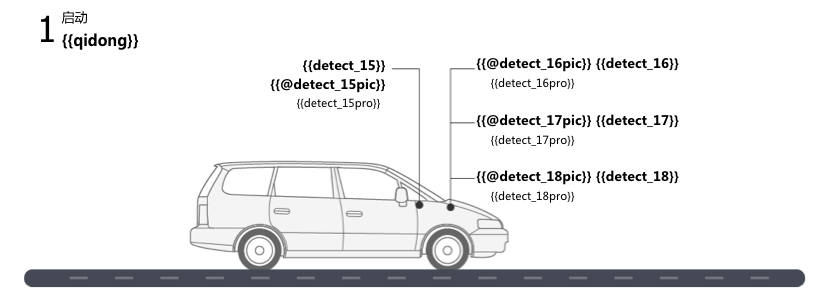
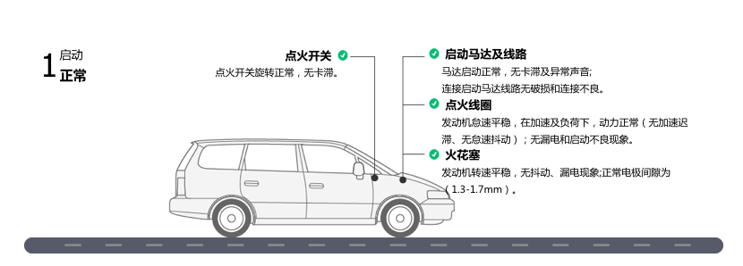

# Poi-tl(Poi-template-language)

[](https://travis-ci.org/Sayi/poi-tl)   

:memo:  Word 模板引擎，基于Apache POI进行了一些增强封装，如合并多个Word文档、合并单元格、图片处理等，插件机制使得可以基于模板引擎特性扩展出更丰富的功能。

> **模板和插件构建了整个Poi-tl的核心。**

下表对一些处理Word的解决方案作了一些比较：

| 方案 | 跨平台 | 样式处理  | 易用性
| --- | --- | --- | --- |
| **Poi-tl** | 纯Java组件，跨平台 | :white_check_mark: 不需要编码，模板即样式 | :white_check_mark: 简单：模板引擎，对POI进行封装
| Apache POI | 纯Java组件，跨平台 | 编码 | :white_check_mark: 简单, 没有模板引擎功能
| Freemarker | XML操作，跨平台 | 无 | 复杂，需要理解XML结构，基于XML构造模板
| OpenOffice | 需要安装OpenOffice软件 | 编码 | 复杂，需要了解OpenOffice的API
| Jacob、winlib | Windows平台 | 编码 | 复杂，不推荐使用

## Maven

```xml
<dependency>
  <groupId>com.deepoove</groupId>
  <artifactId>poi-tl</artifactId>
  <version>1.3.1</version>
</dependency>
```

## 2分钟快速入门
从一个超级简单的例子开始：把{{title}}替换成"Poi-tl 模板引擎"。

1. 新建文档template.docx，包含文本{{title}}
2. TDO模式：Template + data-model = output

```java
//核心API采用了极简设计，只需要一行代码
XWPFTemplate template = XWPFTemplate.compile("~/template.docx").render(new HashMap<String, Object>(){{
        put("title", "Poi-tl 模板引擎");
}});
FileOutputStream out = new FileOutputStream("out_template.docx");
template.write(out);
out.flush();
out.close();
template.close();
```

## 基本语法
所有的语法结构都是以 {{ 开始，以 }} 结束。

### 文本模板 {{var}} 
`TextRenderData`或`String`数据模型，继承模板样式的同时，也可以自定义颜色、字体等样式。
```java
Map<String, Object> datas = new HashMap<String, Object>();
datas.put("author", new TextRenderData("00FF00", "Sayi卅一"));
datas.put("introduce", "http://www.deepoove.com");
```

### 图片模板 {{@var}}
```java
//本地图片
put("localPicture", new PictureRenderData(120, 120, "src/test/resources/sayi.png"));
//本地图片byte数据
put("localBytePicture", new PictureRenderData(100, 120, ".png", BytePictureUtils.getLocalByteArray(new File("src/test/resources/logo.png"))));
```

### 表格模板 {{#var}}
```java
RowRenderData header = RowRenderData.build(new TextRenderData("FFFFFF", "姓名"), new TextRenderData("FFFFFF", "学历"));
RowRenderData row = RowRenderData.build(new TextRenderData("张三"), new TextRenderData("1E915D", "研究生"));
put("table", new MiniTableRenderData(header, Arrays.asList(row)));
```

### 列表模板 {{*var}}
```java
put("feature", new NumbericRenderData(new ArrayList<TextRenderData>() {
  {
    add(new TextRenderData("Plug-in grammar, add new grammar by yourself"));
    add(new TextRenderData("Supports word text, header, footer..."));
    add(new TextRenderData("Templates, not just templates, but also style templates"));
  }
}));
```

### 文档模板 {{+var}}
`DocxRenderData`数据模型，支持文档的合并，文档模板(重复文档段落)被集合数据循环渲染后合并。
```java
List<SegmentData> segments = new ArrayList<SegmentData>();
SegmentData s1 = new SegmentData();
s1.setTitle("经常抱怨的自己");
s1.setContent("每个人生活得都不容易，经常向别人抱怨的人，说白了就是把对方当做“垃圾场”，你一股脑地将自己的埋怨与不满倒给别人，自己倒是爽了，你有考虑过对方的感受吗？对方的脸上可能一笑了之，但是心里可能有一万只草泥马奔腾而过。");
segments.add(s1);

SegmentData s2 = new SegmentData();
s2.setTitle("拖拖拉拉的自己");
s2.setContent("能够今天做完的事情，不要拖到明天，你的事情没有任何人有义务去帮你做；不要做“宅男”、不要当“宅女”，放假的日子约上三五好友出去转转；经常动手做家务，既能分担伴侣的负担，又有一个干净舒适的环境何乐而不为呢？");
segments.add(s2);

put("docx_word", new DocxRenderData(new File("~/segment.docx"), segments));
```

## 详细文档与示例

[中文文档](http://deepoove.com/poi-tl) or [English-tutorial Wiki](https://github.com/Sayi/poi-tl/wiki/2.English-tutorial)

* [基础示例：软件说明文档](http://deepoove.com/poi-tl/#_%E8%BD%AF%E4%BB%B6%E8%AF%B4%E6%98%8E%E6%96%87%E6%A1%A3)
* [表格示例：付款通知书](http://deepoove.com/poi-tl/#example-table)
* [循环模板示例：文章写作](http://deepoove.com/poi-tl/#example-article)
* [Example：个人简历](http://deepoove.com/poi-tl/#_%E4%B8%AA%E4%BA%BA%E7%AE%80%E5%8E%86)

更多的示例以及所有示例的源码参见JUnit单元测试。




## 建议和完善
欢迎在GitHub Issue中提问和交流。

