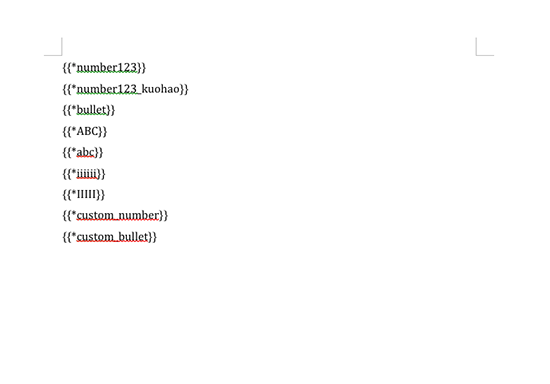
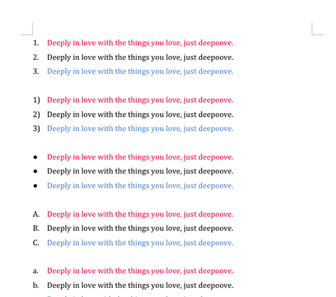

# poi-tl

  

Java对word的模板进行渲染(替换)的跨平台组件，对docx格式的文档增加模板语法，增加渲染模板的方便性，目前支持对段落、页眉、页脚、表格的文本、图片、表单渲染。

对于word模板替换，我们不仅要考虑复杂的模板格式，还要考虑字体，颜色，处理页眉页脚，使用稍显复杂的poi的API等，现实项目中又有许多需求需要后台动态生成数据然后替换word模板，供前台下载或者打印，为了避免：
* java操作word使用apache poi的复杂性
* 使用freemarker，转化为xml操作word的难度
* 依赖服务器上安装软件openoffice来调用转化
* 依赖windows的word lib库，不具有跨平台性

因此基于poi开发了一套拥有简洁API的跨平台的模板引擎：poi-tl。核心API只需要一行代码：

	XWPFTemplate template = XWPFTemplate.compile("~/file.docx").render(datas);

**PS：本项目在国内某大型垂直行业互联网公司已稳定运行一年以上，负责动态渲染样式超级复杂的word报告的下载和打印。**

# Change log

V0.0.5 
1. bugfix: 解决0.0.4版本解析模板时CTSignedTwips类加载不到的问题  
2. new feature: 新增列表语法*，支持对有序列表和无序列表的插入 

V0.0.4 
1. 增加新的api:XWPFTemplate.compile  
2. 渲染数据除了支持Map以外，还支持JavaBean渲染 
3. 升级poi组件至最新版本3.16

V0.0.3  
1. 新增表单语法#  
2. 支持表单插入  
2. 渲染器支持对table动态处理DynamicTableRenderPolicy  
3. 支持单元格的合并  
4. 丰富文本样式

# 使用
    <dependency>
        <groupId>com.deepoove</groupId>
        <artifactId>poi-tl</artifactId>
        <version>0.0.5</version>
    </dependency>

# 语法
所有的语法结构都是以 {{ 开始，以 }} 结束(**在下一版本中，语法将支持自定义**)，文档的样式继承模板标签的样式，也可以在渲染数据中指定,实现了样式的最大自由化。

* {{template}}

普通文本，渲染数据为：String或者TextRenderData

* {{@template}}

图片,渲染数据为：PictureRenderData

* {{#template}}

表格，渲染数据为：TableRenderData

* {{*template}}

列表，渲染数据为：NumbericRenderData

# Usage1-Map渲染
    
    Map<String, Object> datas = new HashMap<String, Object>(){{
            put("author", new TextRenderData("000000", "Sayi"));
            put("date", "2015-04-01");
            //表格模板
            put("changeLog", new TableRenderData(new ArrayList<RenderData>(){{
				add(new TextRenderData("d0d0d0", ""));
				add(new TextRenderData("d0d0d0", "introduce"));
			}},new ArrayList<Object>(){{
				add("1;add new # gramer");
				add("2;support insert table");
				add("3;support more style");
			}}, "no datas", 10600));
		    //图片模板
            put("logo",  new PictureRenderData(100, 100, "/Users/Sayi/image.png"));
    }};

    //render
    XWPFTemplate template = XWPFTemplate.compile("src/test/resources/PB.docx").render(datas);

    //out document
    FileOutputStream out = new FileOutputStream("out.docx");
    template.write(out);
    template.close();
    out.close();

# Usage2-JavaBean渲染

	DataSourceTest obj = new DataSourceTest();
	obj.setHeader_version("v0.0.4");
	obj.setHello("v0.0.4");
	obj.setWebsite("http://www.deepoove.com/poi-tl");
	//图片模板
	obj.setLogo(new PictureRenderData(100, 120, "src/test/resources/logo.png"));
	obj.setTitle(new TextRenderData("9d55b8",
				"Deeply in love with the things you love,\\n just deepoove."));
		
	XWPFTemplate template = XWPFTemplate.compile("src/test/resources/PB.docx").render(obj);
	FileOutputStream out = new FileOutputStream("out.docx");
	template.write(out);
	template.close();
	out.flush();
	out.close();

# Usage3-插入列表

	/**
	 * file:NumbericRenderTest.java
	 */
	Map<String, Object> datas = new HashMap<String, Object>() {{
		//1. 2. 3.
		put("number123", new NumbericRenderData(FMT_DECIMAL, new ArrayList<TextRenderData>() {{
			add(new TextRenderData("df2d4f", "Deeply in love with the things you love, just deepoove."));
			add(new TextRenderData("Deeply in love with the things you love, just deepoove."));
			add(new TextRenderData("5285c5", "Deeply in love with the things you love, just deepoove."));
		}}));
		//1) 2) 3)
		put("number123_kuohao", getData(FMT_DECIMAL_PARENTHESES));
		//无序
		put("bullet", getData(FMT_BULLET));
		//A B C
		put("ABC", getData(FMT_UPPER_LETTER));
		//a b c
		put("abc", getData(FMT_LOWER_LETTER));
		//ⅰ ⅱ ⅲ
		put("iiiiii", getData(FMT_LOWER_ROMAN));
		//Ⅰ Ⅱ Ⅲ
		put("IIIII", getData(FMT_UPPER_ROMAN));
		//自定义有序列表显示 (one) (two) (three)
		put("custom_number", getData(Pair.of(STNumberFormat.CARDINAL_TEXT, "(%1)")));
		//自定义无序列表显示：定义无序符号
		put("custom_bullet", getData(Pair.of(STNumberFormat.BULLET, "♬")));
	}};
	XWPFTemplate template = XWPFTemplate.compile("src/test/resources/numberic.docx").render(datas);
	FileOutputStream out = new FileOutputStream("out.docx");
	template.write(out);
	out.flush();
	out.close();
	template.close();

# 渲染图
* word模板文件  

* word渲染后生成的文件  

* word模板文件  

* word渲染后生成的文件  

* word模板文件  

* word渲染后生成的文件  

# 文档
详细文档高级扩展请参见:[poi-tl文档](http://deepoove.com/poi-tl/)

# 建议和完善
问题可以在issue中提问，任何bug可以直接pull request。

