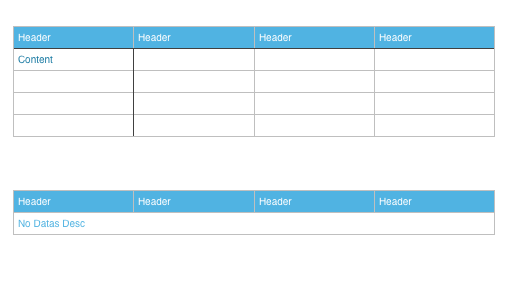
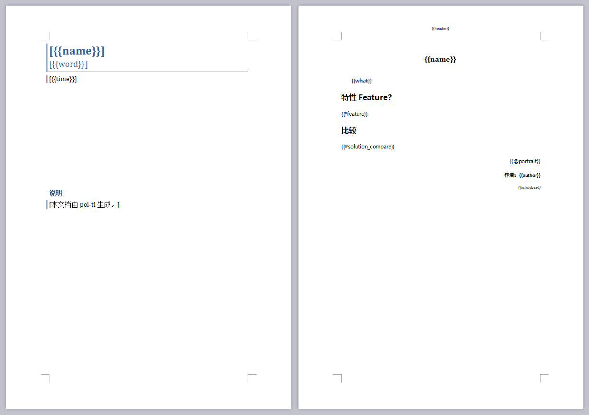
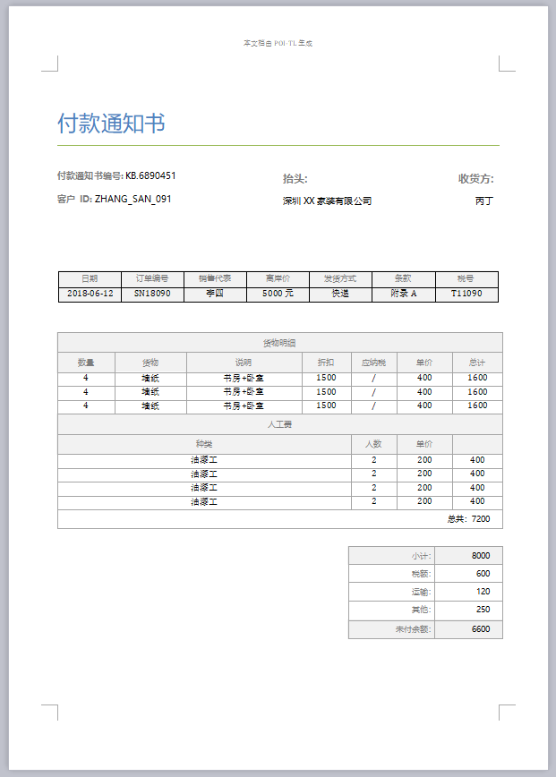
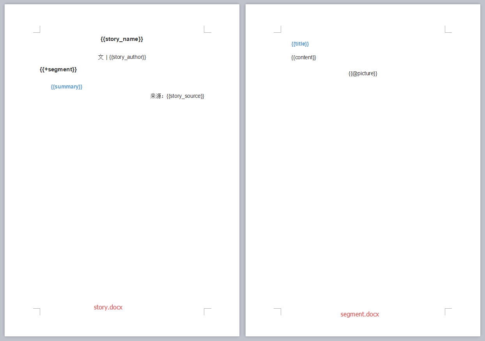

= poi-tl
Sayi 卅一 <adasai90@gmail.com>
v1.5.0
:description: word模板引擎
:keywords: poi,word,docx,template,模板
:doctype: book
:encoding: utf-8
:lang: en
:toc: left
:icons: font
:source-highlighter: prettify
:numbered:
:nofooter:
:sectlinks:
:sectanchors:

poi-tl（poi template language）是基于Apache POI的Word模板引擎，纯Java组件，跨平台，代码短小精悍，通过插件机制使其具有高度扩展性。

CAUTION: 在文档的任何地方做任何事情（_Do Anything Anywhere_）是poi-tl的星辰大海。

== Maven
poi-tl分为两个版本，其中v1.5.x支持Apache poi3.16+版本和JDK1.6+。
[source, xml]
----
<dependency>
    <groupId>com.deepoove</groupId>
    <artifactId>poi-tl</artifactId>
    <version>1.5.0</version>
</dependency>
----

Apache poi4.0.0+要求JDK1.8以上，需要引入最新的poi-tl版本：
[source, xml]
----
<dependency>
  <groupId>com.deepoove</groupId>
  <artifactId>poi-tl</artifactId>
  <version>1.6.0-beta1</version>
</dependency>
----

== Gradle 
[source, groovy]
compile group: 'com.deepoove', name: 'poi-tl', version: '1.5.0'

== 快速开始
=== 2min入门
新建Word模板template.docx，包含内容{{title}}
[example]
{{title}}

[sidebar]
.代码示例
--
[source, java]
----
XWPFTemplate template = XWPFTemplate.compile("~/template.docx").render(new HashMap<String, Object>(){{ <1> <2>
        put("title", "Poi-tl 模板引擎");
}});
FileOutputStream out = new FileOutputStream("out_template.docx");
template.write(out); <3>
out.flush();
out.close();
template.close();
----
<1> 编译模板
<2> 渲染数据
<3> 输出到流

*TDO模式：Template + data-model = output*
--

=== Template：Word模板和样式
Word文档支持DOCX格式，所有的模板标签都是以 `{{` 开头，以 `}}` 结尾，模板标签可以出现在任何非文本框的位置，包括页眉，页脚，表格内部等等。

IMPORTANT: 表格布局可以设计出很多优秀专业的文档，模板文档请使用表格布局，不支持文本框。

poi-tl的一个核心特点是 *数据模型与样式的分离*，同样的数据模型可以用来渲染各种不同样式的模板。

文档的样式继承模板标签的样式，即如果模板{{title}}是蓝色微软雅黑加粗四号字体，则替换后的文本也是蓝色微软雅黑加粗四号字体。

 

=== Data-Model：数据源
数据源的结构体是一个标签名称和数据模型映射的集合，即[{标签名称, 数据模型}]。数据源可以是一个Map，其中key是标签名称；可以是一个JavaBean，field名称是标签名称，也可以通过注解@Name设置标签名称。

[source, java]
----
// 模板标签d_number
@Name("d_number")
private String dNumber;
// 模板标签m_vin
private String m_vin;
----

TIP: poi-tl默认的表达式支持对象点缀式访问，比如名称为{{author.name}}的标签对应的数据是author对象的name属性值。表达式也支持中文，比如{{客户手机号}}。

数据模型实现了接口 `public interface RenderData {}` , 有以下几种数据模型：

* TextRenderData、HyperLinkTextRenderData
* PictureRenderData
* MiniTableRenderData
* NumbericRenderData
* DocxRenderData

=== output：流
可以将最终结果渲染到任意输出流中，比如输出到文件流FileOutputStream生成新文档，输出到网络流ServletOutputStream供浏览器下载。

[source, java]
----
// 输出到任何流
template.write(OutputStream stream)

// 便捷的输出到文件
template.writeToFile(String path)
----

== 语法
poi-tl內建了五种模板。

=== 文本模板{{var}}
[example]
{{var}}

`TextRenderData` 或 `String` 数据模型。

[sidebar]
.代码示例
--
[source, java]
put("author", new TextRenderData("000000", "Sayi卅一"));
put("introduce", "http://www.deepoove.com");
put("link", new HyperLinkTextRenderData("website.", "http://www.deepoove.com"));
--

除了继承模板标签样式，也提供了通过代码设定文本样式的方式。

[sidebar]
.`TextRenderData` 的结构体
--
[source, json]
----
{
  "text": "Sayi",
  "style": {
    "strike": false, <1>
    "bold": true, <2>
    "italic": false, <3>
    "color": "00FF00", <4>
    "underLine": false, <5>
    "fontFamily": "微软雅黑", <6>
    "fontSize": 12, <7>
    "highlightColor": "green" <8>
  }
}
----
<1> 删除线
<2> 粗体
<3> 斜体
<4> 颜色
<5> 下划线
<6> 字体
<7> 字号
<8> 背景高亮色

注：HyperLinkTextRenderData继承于TextRenderData，实现了超链接文本的功能。
--
NOTE: 结构体只是数据模型的可视化展示，数据模型不是文本型的，而是Java对象。下文中出现的所有结构体也都如此。

TIP: 文本换行使用 `\n` 字符。

=== 图片模板{{@var}}
[example]
{{@var}}

`PictureRenderData` 数据模型。

[sidebar]
.代码示例
--
[source, java]
----
// 本地图片
put("localPicture", new PictureRenderData(120, 120, "./sayi.png"));

// 图片流文件
put("localBytePicture", new PictureRenderData(100, 120, ".png", new FileInputStream("./logo.png")));

// 网络图片 
put("urlPicture", new PictureRenderData(100, 100, ".png", BytePictureUtils.getUrlBufferedImage("https://avatars3.githubusercontent.com/u/1394854")));

// java 图片
put("bufferImagePicture", new PictureRenderData(100, 120, ".png", bufferImage)));
----
--
可以指定图片的宽度和高度，也支持 `BufferedImage`，这样我们可以利用Java生成任意图表插入到word文档中。

[sidebar]
.`PictureRenderData` 的结构体
--
[source, json]
----
{
  "path": "", <1>
  "data": [], <2>
  "altMeta": "图片不存在", <3>
  "width": 100, <4>
  "height": 100 <5>
}
----
<1> 图片路径
<2> 图片也可以是byte[]字节数组
<3> 当无法获取图片时展示的文字
<4> 宽度
<5> 高度
--

=== 表格模板{{#var}}
[example]
{{#var}}

poi-tl默认实现了N行N列的样式(如下图)，同时提供了当数据为空时，展示一行空数据的文案(如下图中的No Data Descs)，数据模型是 `MiniTableRenderData` 。

[sidebar]
.`MiniTableRenderData` 的结构体
--
[source, json]
----
{
  "rowDatas": [ <1>
    {
      "cellDatas": [ <2>
        {
          "renderData": [TextRenderData],
          "cellStyle": { <3>
            "align": "center", 
            "backgroundColor": "ff9800"
          }
        }
      ],
      "rowStyle": { <4>
        "align": "center", 
        "backgroundColor": "ff9800"
      }
    }
  ],
  "header": { <5>
    "cellDatas": [
      {
        "renderData": [TextRenderData],
        "cellStyle": { 
          "align": "center", 
          "backgroundColor": "ff9800"
        }
      }
    ],
    "rowStyle": { <4>
      "align": "center", 
      "backgroundColor": "ff9800"
    }
  },
  "noDatadesc": "No Data Desc", <6>
  "style": { <7>
      "align": "center"
    }
  "width": 14.65 <8>
}
----
<1> 定义表格数据
<2> 定义单元格数据，数据由 `TextRenderData` 指定
<3> 单元格样式：对齐方式，背景色
<4> 行样式：行数据的对齐方式，行背景色
<5> 定义表格头
<6> 没有数据的展示文案
<7> 表格样式：表格居左、居中、居右对齐
<8> 表格宽度，单位cm
--

[sidebar]
.代码示例
--
[source, java]
----
RowRenderData header = RowRenderData.build(new TextRenderData("FFFFFF", "姓名"), new TextRenderData("FFFFFF", "学历"));

RowRenderData row0 = RowRenderData.build("张三", "研究生");
RowRenderData row1 = RowRenderData.build("李四", "博士");
RowRenderData row2 = RowRenderData.build("王五", "博士后");

put("table", new MiniTableRenderData(header, Arrays.asList(row0, row1, row2)));
----
--

NOTE: 表格的宽度(单位CM)怎么定义的: 页面宽度 - 页边距宽度 * 2 = 表格的最大宽度。
页面宽度为A4(20.99 * 29.6，页边距为3.17 * 2.54)的文档最大表格宽度14.65CM。可以根据需要指定表格宽度。

需求的丰富多彩往往是默认表格样式无法满足的，我们通常会遇到以下两个场景：

*场景一*： 完全由自己掌控整个表格的生成：参见link:#cus-policy-section[插件机制-新增RenderPolicy策略]。

*场景二*： 在一个已有的表格中，动态处理某些单元格数据：提供了抽象表格策略DynamicTableRenderPolicy，参见link:#example-table[示例-付款通知书]。

=== 列表模板{{*var}}
[example]
{{*var}}

`NumbericRenderData` 数据模型。
[sidebar]
.代码示例
--
[source, java]
----
put("feature", new NumbericRenderData(new ArrayList<TextRenderData>() {
  {
    add(new TextRenderData("Plug-in grammar"));
    add(new TextRenderData("Supports word text, header..."));
    add(new TextRenderData("Not just templates, but also style templates"));
  }
}));
----
--
列表样式支持罗马字符、有序无序等。参见NumbericRenderData.FMT_*。
[source]
FMT_DECIMAL //1. 2. 3.
FMT_DECIMAL_PARENTHESES //1) 2) 3)
FMT_BULLET //● ● ●
FMT_LOWER_LETTER //a. b. c.
FMT_LOWER_ROMAN //i ⅱ ⅲ
FMT_UPPER_LETTER //A. B. C.

=== 文档模板{{+var}}
[example]
{{+var}}

`DocxRenderData` 数据模型，可以是另一个docx文档的合并，或者是数据集合针对同一个模板的多个渲染结果的合并。
[sidebar]
.代码示例
--
[source, java]
----
List<SegmentData> segments = new ArrayList<SegmentData>();
SegmentData s1 = new SegmentData();
s1.setTitle("经常抱怨的自己");
s1.setContent("每个人生活得都不容易，经常向别人抱怨的人，说白了就是把对方当做“垃圾场”，你一股脑地将自己的埋怨与不满倒给别人，自己倒是爽了，你有考虑过对方的感受吗？对方的脸上可能一笑了之，但是心里可能有一万只草泥马奔腾而过。");
segments.add(s1);

SegmentData s2 = new SegmentData();
s2.setTitle("拖拖拉拉的自己");
s2.setContent("能够今天做完的事情，不要拖到明天，你的事情没有任何人有义务去帮你做；不要做“宅男”、不要当“宅女”，放假的日子约上三五好友出去转转；经常动手做家务，既能分担伴侣的负担，又有一个干净舒适的环境何乐而不为呢？");
segments.add(s2);

put("docx_word", new DocxRenderData(new File("~/segment.docx"), segments)); <1> <2>
----
<1> 主模板包含标签{{+docx_word}}
<2> segment.docx是一个包含了{{title}}和{{content}}的待合并模板，使用segments集合数据渲染后合并到主模板
--
参见link:#example-article[示例-一篇文章]

== 插件机制(Plugin mechanism)
*插件机制是poi-tl的核心*，默认的五大內建模板语法是通过插件方式加载的。插件的核心逻辑是在模板的基础上通过poi-tl和poi提供的API操作word文档，实现插件就是实现自己的渲染策略。

CAUTION: 由于需要操作Word文档，我们需要掌握一些Apache POI API的知识，可以参见Apache官方API，这里也有一个快速入门的教程：link:http://deepoove.com/poi-tl/apache-poi-guide.html[Apache POI Word(docx) 入门示例教程]。如果你写了一个不错的插件，欢迎提交Pull Request。

[[cus-policy-section]]
=== 新增RenderPolicy策略
內建策略是poi-tl自带的一些渲染策略，用来处理文本、图片、列表、表格、文档合并等：

* TextRenderPolicy
* PictureRenderPolicy
* NumbericRenderPolicy
* MiniTableRenderPolicy
* DocxRenderPolicy

我们可以通过实现 `RenderPolicy` 接口扩展自己的渲染策略：
[source, java]
----
public interface RenderPolicy {
  void render(ElementTemplate eleTemplate, Object data, XWPFTemplate template); <1> <2> <3>
}
----
<1> ElementTemplate是当前模板标签所在位置
<2> data是数据模型
<3> 通过XWPFTemplate获得Apache POI增强类NiceXWPFDocument，继而可以在当前模板标签位置插入段落，图片，表格等

NOTE: 原则上Apache POI支持的操作，都可以在当前模板位置进行渲染。

[example]
--
示例：我们创建一个自己的表格渲染策略CustomTableRenderPolicy，使用表格API来操作表格，`doc.insertNewTable()` 是在当前模板位置插入表格，正如可以实现任何渲染逻辑一样，我们可以随心所欲的操作表格了。

AbstractRenderPolicy是一个抽象模板类，定义了一些骨架步骤并且将数据模型的校验和渲染逻辑分开，新的策略继承AbstractRenderPolicy类不是必须的。
[source, java]
----
public class CustomTableRenderPolicy extends AbstractRenderPolicy<Object> {

  @Override
  protected void afterRender(RenderContext context) {
    // 清空模板标签所在段落
    clearPlaceholder(context, true);
  }

  @Override
  public void doRender(RunTemplate runTemplate, Object data, XWPFTemplate template)
      throws Exception {

    NiceXWPFDocument doc = template.getXWPFDocument();
    XWPFRun run = runTemplate.getRun();
    // 定义行列
    int row = 10, col = 8;
    // 插入表格
    XWPFTable table = doc.insertNewTable(run, row, col);

    // 定义表格宽度、边框和样式
    TableTools.widthTable(table, MiniTableRenderData.WIDTH_A4_FULL, col);
    TableTools.borderTable(table, 4);

    // 调用XWPFTable API操作表格：data对象可以包含任意你想要的数据，包括图片文本等
    // 调用MiniTableRenderPolicy.Helper.renderRow方法快速方便的渲染一行数据
    // 调用TableTools类方法操作表格，比如合并单元格
    // ......
    TableTools.mergeCellsHorizonal(table, 0, 0, 7);
    TableTools.mergeCellsVertically(table, 0, 1, 9);
    
  }
}
----
--

=== 自定义模板策略
所有的插件都是通过如下构建器来配置：
[source, java]
ConfigureBuilder builder = Configure.newBuilder();
XWPFTemplate.compile("~/template.docx", builder.buid());

当我们有个模板标签为{{report}}，它本身是一个文本模板，如果希望在这个位置做些不一样或者更复杂的事情，我们可以通过构建器设定模板的渲染策略：
[source, java]
builder.customPolicy("report", new MyRenderPolicy());

=== 新增语法插件
比如增加%语法：{{%var}}，对应自定义的渲染策略 `PercentRenderPolicy`，加载插件代码如下：
[source, java]
builder.addPlugin('%', new PercentRenderPolicy());

由于內建模板也是通过插件方式加载的，我们甚至可以改变它们的语法：
[source, java]
builder.addPlugin('@', new MiniTableRenderPolicy());
builder.addPlugin('#', new PictureRenderPolicy());

这样{{@var}}就变成了表格模板，{{#var}}变成了图片模板，虽然不建议改变內建模板，但是从中可以看到poi-tl插件的设计思想，深藏功与名。

=== Helper辅助类
在內建策略中，通常会提供一个静态Helper辅助类，在我们实现自己的RenderPolicy时，也可以通过这些辅助类操作文档。
[source, java]
----
// 某个位置渲染文本
TextRenderPolicy.Helper.renderTextRun(XWPFRun, Object);
// 某个位置渲染图片
PictureRenderPolicy.Helper.renderPicture(XWPFRun, PictureRenderData);
// 某个位置渲染列表
NumbericRenderPolicy.Helper.renderNumberic(XWPFRun, NumbericRenderData);
// 渲染表格的一行数据
MiniTableRenderPolicy.Helper.renderRow(XWPFTable, int, RowRenderData);
// 渲染单元格
MiniTableRenderPolicy.Helper.renderCell(XWPFTableCell, CellRenderData, TableStyle)
----

== 扩展功能
=== EL表达式：SpingEL
Spring Expression Language (SpEL)是一个强大的表达式语言，支持在运行时查询和操作对象图。在使用SpEL前需要引入相应的依赖：
[source, xml]
----
<dependency>
  <groupId>org.springframework</groupId>
  <artifactId>spring-expression</artifactId>
  <version>4.3.6.RELEASE</version>
</dependency>
----

poi-tl的表达式模板支持切换到SpEL模式：
[source, java]
----
ConfigureBuilder builder = Configure.newBuilder();
builder.setElMode(ELMode.SPEL_MODE);
----
关于SpEL的写法可以参见官网，下面给出一些典型的示例。
[example]
--
[source]
----
{{name}}
{{name.toUpperCase()}} <1>
{{empty?:'这个字段为空'}}
{{sex ? '男' : '女'}} <2>
{{new java.text.SimpleDateFormat('yyyy-MM-dd HH:mm:ss').format(time)}} <3>
{{new java.text.SimpleDateFormat('yyyy-MM-dd hh:mm').format(time)}}
{{price/10000 + '万元'}} <4>
{{dogs[0].name}} <5>
{{dogs[0].age}}
----
<1> 方法调用
<2> 三目运算符
<3> 方法调用
<4> 运算符
<5> 数组列表
--

TIP: poi-tl提供了表达式计算接口 `RenderDataCompute`，它是一个很重要的扩展点，支持扩展任何的表达式引擎。SpEL模式是通过 `SpELRenderDataCompute` 实现。

=== 自定义语法
高度扩展性表现在其本身的语法也可以自定义，如果你不喜欢 `{{}}` 的方式，更偏爱freemarker `${}` 的方式：
[source, java]
builder.buildGramer("${", "}");

=== 模板生成模板
模板引擎不仅仅可以生成文档，也可以生成新的模板，比如我们想构造这样的新模板：把原先的一个模板标签分成两个模板标签：

[source, java]
put("title", "{{title}}\n{{subtitle}}");

== 示例
接下来的示例采取三段式output+template+data-model来说明，首先直接展示生成后的文档，然后一览模板的样子，最后我们对数据模型做个介绍。

=== 软件说明文档
[example]
--
.output
需要生成这样的一份软件说明书：拥有封面和页眉，正文含有不同样式的文本，还有表格，列表和图片。下载最终生成的文件link:example/poi_tl.docx[poi_tl.docx]

image::example/example_poitl_output.png[align='center']
--

[example]
--
.template
使用poi-tl语法制作模板，可以看到模板标签不仅仅是模板，同样也是样式标签。

--

这个示例向我们展示了poi-tl最基本的能力，它在模板标签位置，插入基本的数据模型。同时也向我们展示了无需编码设置样式：模板，不仅仅是标签模板，还是样式模板。

NOTE: 源码参见link:https://github.com/Sayi/poi-tl/blob/master/src/test/java/com/deepoove/poi/tl/XWPFTemplateTest.java[Junit XWPFTemplateTest]

[[example-table]]
=== 付款通知书
[example]
--
.output
需要生成这样的一份流行的通知书：大部分数据是由表格构成的，需要创建一个订单的表格，还需要在一个已有表格中，填充货物明细和人工费数据。下载最终生成的文件link:example/payment.docx[payment.docx]

--

[example]
--
.template
使用{{#order}}生成poi-tl提供的默认样式的表格，设置{{detail_table}}为自定义模板渲染策略(继承抽象表格策略DynamicTableRenderPolicy)，自定义已有表格中部分单元格的渲染。

image::example/example_payment_template.png[align='center']
--

这个示例向我们展示了poi-tl在表格操作上的一些思考。示例中货物明细和人工费的表格就是一个相当复杂的表格，货物明细是由7列组成，行数不定，人工费是由4列组成，行数不定。

默认表格数据模型(MiniTableRenderData)实现了最基本的样式，当需求中的表格更加复杂的时候，我们完全可以设计好那些固定的部分，将需要动态渲染的部分单元格交给自定义模板渲染策略。

poi-tl提供了抽象表格策略DynamicTableRenderPolicy来实现这样的功能，{{detail_table}}标签可以在表格内的任意单元格内，DynamicTableRenderPolicy会获取XWPFTable对象进而获得操作整个表格的能力。
[source, java]
----
public abstract class DynamicTableRenderPolicy implements RenderPolicy {
  public abstract void render(XWPFTable table, Object data);
}
----

新建渲染策略DetailTablePolicy，继承于抽象表格策略。
[source, java]
----
public class DetailTablePolicy extends DynamicTableRenderPolicy {

  // 货品填充数据所在行数
  int goodsStartRow = 2;
  // 人工费填充数据所在行数
  int laborsStartRow = 5;

  @Override
  public void render(XWPFTable table, Object data) {
    if (null == data) return;
    DetailData detailData = (DetailData) data;

    // 人工费循环渲染
    List<RowRenderData> labors = detailData.getLabors();
    if (null != labors) {
      table.removeRow(laborsStartRow);
      // 循环插入行
      for (int i = 0; i < labors.size(); i++) {
        XWPFTableRow insertNewTableRow = table.insertNewTableRow(laborsStartRow);
        for (int j = 0; j < 7; j++) insertNewTableRow.createCell();

        // 合并单元格
        TableTools.mergeCellsHorizonal(table, laborsStartRow, 0, 3);
        // 渲染单行人工费数据
        MiniTableRenderPolicy.Helper.renderRow(table, laborsStartRow, labors.get(i));
      }
    }

    // 货品明细
    List<RowRenderData> goods = detailData.getGoods();
    if (null != goods) {
      table.removeRow(goodsStartRow);
      for (int i = 0; i < goods.size(); i++) {
        XWPFTableRow insertNewTableRow = table.insertNewTableRow(goodsStartRow);
        for (int j = 0; j < 7; j++) insertNewTableRow.createCell();
        // 渲染单行货品明细数据
        MiniTableRenderPolicy.Helper.renderRow(table, goodsStartRow, goods.get(i));
      }
    }
  }
}
----

将模板标签{{detail_table}}设置成此策略。
[source, java]
Configure config = Configure.newBuilder().customPolicy("detail_table", new DetailTablePolicy()).build();

NOTE: 源码参见link:https://github.com/Sayi/poi-tl/blob/master/src/test/java/com/deepoove/poi/tl/example/PaymentExample.java[Junit PaymentExample]

[[example-article]]
=== 一篇文章
[example]
--
.output
需要生成这样的一系列文章：除了标题作者之外，它的内容是有规律的，内容是由一行蓝色的标题，一段文字，一张图片构成。下载最终生成的文件link:example/story.docx[story.docx]

--

[example]
--
.template
文章的内容是个典型的文档模板类型，我们制作一个待合并的文档模板segment.docx(下图右侧)，主模板story.docx看起来很简单，其中{{+segment}}标签将会被文档模板循环合并。

--

这个示例充分展示了poi-tl的文档模板和循环功能。当有一段固定样式的段落，根据集合数据循环填充后展示。示例中标题+文字+图片就是这样的可重复段落。

基本原理是后台提供数据模型的集合，不断渲染segment.docx，将渲染结果合并到story.docx文档中。

NOTE: 源码参见link:https://github.com/Sayi/poi-tl/blob/master/src/test/java/com/deepoove/poi/tl/example/StoryExample.java[Junit StoryExample]

=== 个人简历
[example]
--
.output
需要生成这样的一份流行的个人简历：左侧是个人的基本信息，技术栈是个典型的列表，右侧是个人的工作经历，数量不定。下载最终生成的文件link:example/resume.docx[resume.docx]

image::example/example_resume_output.png[align='center']
--

[example]
--
.template
工作经历是个典型的文档模板类型，我们制作两个模板，一套主模板简历.docx(下图左侧)，一套为文档模板segment.docx(下图右侧)。

image::example/example_resume_template.png[align='center']
--

看起来很复杂的简历，其实对于模版引擎来说，和普通的Word文档没有什么区别，我们只需要制作好一份简历，将需要替换的内容用模版标签代替。

因为模版即样式，模版引擎无需考虑样式，只关心数据，我们甚至可以制作10种不同样式的简历模板，用同一份数据去渲染。

NOTE: 源码参见link:https://github.com/Sayi/poi-tl/blob/master/src/test/java/com/deepoove/poi/tl/example/ResumeExample.java[Junit ResumeExample]

== License
Apache License 2.0

== 源码
link:https://github.com/Sayi/poi-tl[GitHub]

== 打赏个小费
poi-tl开源的初衷是希望让所有有需要的人享受Word模板引擎的功能，如果你觉得它节省了你的时间，给你带来了方便和灵感，或者认同这个开源项目，可以为我的付出打赏点小费哦。

== 常见问题
[qanda]
出现NoSuchMethodError 、ClassNotFoundException 、NoClassDefFoundError异常？::
  poi-tl依赖的apache-poi版本是3.16+，如果你的项目引用了低版本，请升级或删除。
是否支持文本框？::
  不支持，表格布局可以设计出几乎所有优秀专业的文档，请使用表格。
是否支持生成目录？::
  暂不支持，参考原生POI API自行扩展。
是否支持Android客户端使用？::
  未知，有些朋友尝试成功，但我尚未在Android环境中验证过。
是否支持设置多种标题样式?::
  不能够直接设置，目前支持设置文字字体大小等，或者在已经应用了标题样式的模板中替换文本。
有没有提供图表、数学公式模板？::
  暂不支持，如果是简单的图表，可以考虑通过Java提供的 `BufferedImage` 类创建图片后插入。
