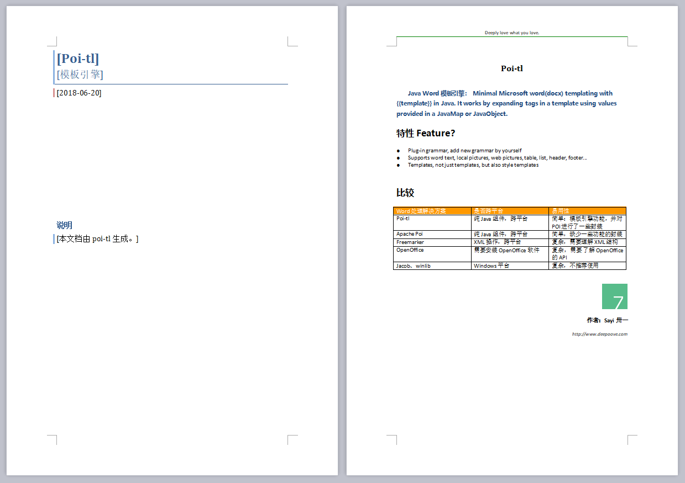
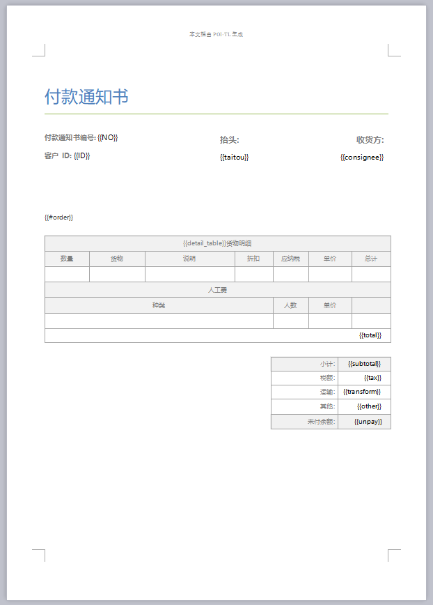
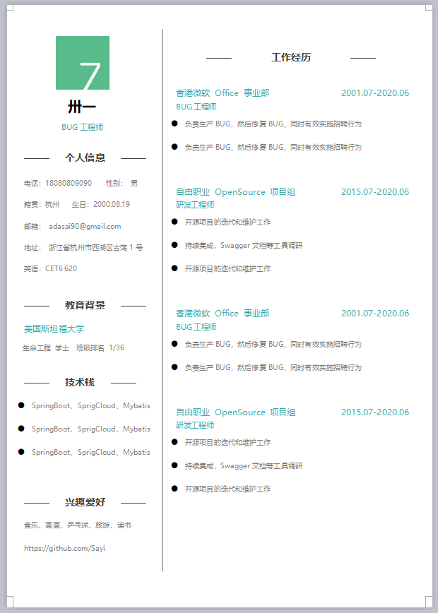
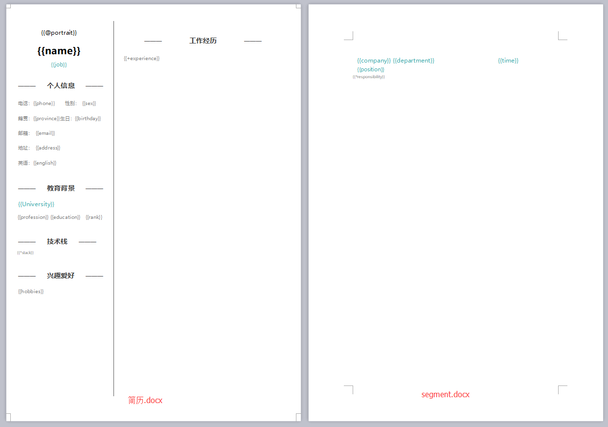

= poi-tl
Sayi 卅一 <adasai90@gmail.com>
v1.3.0
:description: word模板引擎
:keywords: poi, word, docx, template
:doctype: book
:encoding: utf-8
:lang: en
:toc: left
:icons: font
:source-highlighter: prettify
:numbered:
:nofooter:
:sectlinks:
:sectanchors:

poi-tl（poi template language）是基于Apache POI的Word模板引擎。纯Java组件，跨平台，代码短小精悍，通过插件机制使其具有高度扩展性。

TIP: 目前只支持DOCX格式的WORD模板。

== Maven
[source, xml]
----
<dependency>
    <groupId>com.deepoove</groupId>
    <artifactId>poi-tl</artifactId>
    <version>1.3.0</version>
</dependency>
----

== Gradle 
[source, groovy]
compile group: 'com.deepoove', name: 'poi-tl', version: '1.3.0'

== 快速开始
=== 2min入门
新建Word模板template.docx，包含内容{{title}}
[example]
{{title}}

[sidebar]
.代码示例
--
[source, java]
----
XWPFTemplate template = XWPFTemplate.compile("~/template.docx").render(new HashMap<String, Object>(){{ <1> <2>
        put("title", "Poi-tl 模板引擎");
}});
FileOutputStream out = new FileOutputStream("out_template.docx");
template.write(out); <3>
out.flush();
out.close();
template.close();
----
<1> 编译模板
<2> 渲染数据
<3> 输出到流

*Template + data-model = output*
--

=== Template：Word模板和样式
所有的模板标签都是以 `{{` 开头，以 `}}` 结尾。模板标签可以出现在任何非文本框的位置，包括页眉，页脚，表格内部等等。

WARNING: 表格布局可以设计出很多优秀专业的文档，模板文档请使用表格布局，不支持文本框。

文档的样式继承模板标签的样式，这样我们只需要提前设计好模板样式即可，即如果模板{{title}}是蓝色微软雅黑加粗四号字体，则替换后的文本也是蓝色微软雅黑加粗四号字体。

image::./style.png[align='center'] 

=== Data-Model：数据源
数据源的结构体是个键值对的集合：标签名称对应数据模型。除了使用Map之外，还可以使用Java Object，默认Class中的field名称即是标签名称，也可以通过注解@Name设置标签名称。

[source, java]
----
// 模板标签d_number
@Name("d_number")
private String dNumber;
// 模板标签m_vin
private String m_vin;
----

数据模型实现了接口 `public interface RenderData {}` , 有以下5种数据模型：

* TextRenderData
* PictureRenderData
* MiniTableRenderData
* NumbericRenderData
* DocxRenderData

=== output：流
可以将最终结果渲染到任意输出流中，比如输出到文件流FileOutputStream生成新文档，输出到网络流ServletOutputStream供浏览器下载。

== 语法
poi-tl內建了五种模板。

=== 文本模板{{var}}
[example]
{{var}}

`TextRenderData` 或 `String` 数据模型。

[sidebar]
.代码示例
--
[source, java]
put("author", new TextRenderData("000000", "Sayi卅一"));
put("introduce", "http://www.deepoove.com");
--

除了继承模板标签样式，也提供了通过代码设定文本样式的方式。

[sidebar]
.`TextRenderData` 的结构体
--
[source, json]
----
{
  "text": "Sayi",
  "style": {
    "strike": false, <1>
    "bold": true, <2>
    "italic": false, <3>
    "color": "00FF00", <4>
    "underLine": false, <5>
    "fontFamily": "微软雅黑", <6>
    "fontSize": 12 <7>
  }
}
----
<1> 删除线
<2> 粗体
<3> 斜体
<4> 颜色
<5> 下划线
<6> 字体
<7> 字号
--
NOTE: 结构体只是数据模型的可视化展示，数据模型不是文本型的，而是Java对象。下文中出现的所有结构体也都如此。

TIP: 文本换行使用 `\n` 字符。

=== 图片模板{{@var}}
[example]
{{@var}}

`PictureRenderData` 数据模型。

[sidebar]
.代码示例
--
[source, java]
----
// 本地图片
put("localPicture", new PictureRenderData(120, 120, "./sayi.png"));

// 本地图片byte数据
byte[] localByteArray = BytePictureUtils.getLocalByteArray(new File("./logo.png"));
put("localBytePicture", new PictureRenderData(100, 120, ".png", localByteArray));

// 网络图片 
put("urlPicture", new PictureRenderData(100, 100, ".png", BytePictureUtils.getUrlByteArray("https://avatars3.githubusercontent.com/u/1394854")));

// java 图片
put("bufferImagePicture", new PictureRenderData(100, 120, ".png", BytePictureUtils.getBufferByteArray(bufferImage)));
----
--
可以指定图片的宽度和高度，也支持 `BufferedImage`，这样我们可以利用Java生成任意图表插入到word文档中。

[sidebar]
.`PictureRenderData` 的结构体
--
[source, json]
----
{
  "path": "", <1>
  "data": [], <2>
  "width": 100, <3>
  "height": 100 <4>
}
----
<1> 图片路径
<2> 图片也可以是byte[]字节数组
<3> 宽度
<4> 高度
--

=== 表格模板{{#var}}
[example]
{{#var}}

poi-tl默认实现了N行N列的样式(如下图)，同时提供了当数据为空时，展示一行空数据的文案(如下图中的No Data Descs)，数据模型是 `MiniTableRenderData` 。

image::./table0.png[align='center']

[sidebar]
.`MiniTableRenderData` 的结构体
--
[source, json]
----
{
  "datas": [ <1>
    {
      "rowData": [TextRenderData],
      "style": { 
        "align": "center", 
        "backgroundColor": "ff9800"
    }
    }
  ],
  "headers": { <2>
    "rowData": [TextRenderData],
    "style": { <3>
      "align": "center", 
      "backgroundColor": "ff9800"
    }
  },
  "noDatadesc": "No Data Desc", <4>
  "style": { <5>
      "align": "center"
    }
  "width": 8310 <6>
}
----
<1> 定义表格数据，单元格数据由 `TextRenderData` 指定。
<2> 定义表格头
<3> 行样式：行数据的对齐方式，行背景色
<4> 没有数据的展示文案
<5> 表格样式：表格居左、居中、居右对齐
<6> 表格宽度
--

[sidebar]
.代码示例
--
[source, java]
----
RowRenderData header = RowRenderData.build(new TextRenderData("FFFFFF", "姓名"), new TextRenderData("FFFFFF", "学历"));

RowRenderData row0 = RowRenderData.build("张三", "研究生");
RowRenderData row1 = RowRenderData.build("李四", "博士");
RowRenderData row2 = RowRenderData.build("王五", "博士后");

put("table", new MiniTableRenderData(header, Arrays.asList(row0, row1, row2)));
----
--

NOTE: 表格的宽度怎么定义的:

需求的丰富多彩往往是默认表格样式无法满足的，我们通常会遇到以下两个场景：

1. 完全由自己掌控整个表格的生成：参见link:#cus-policy-section[插件机制-自定义模板策略]。
2. 在一个已有的表格中，动态处理某些行数据：提供了抽象表格策略DynamicTableRenderPolicy，参见link:#example-table[示例-付款通知书]。

=== 列表模板{{*var}}
[example]
{{*var}}

`NumbericRenderData` 数据模型。
[sidebar]
.代码示例
--
[source, java]
----
put("feature", new NumbericRenderData(new ArrayList<TextRenderData>() {
  {
    add(new TextRenderData("Plug-in grammar"));
    add(new TextRenderData("Supports word text, header..."));
    add(new TextRenderData("Not just templates, but also style templates"));
  }
}));
----
--
列表样式支持罗马字符、有序无序等。参见NumbericRenderData.FMT_*。
[source]
FMT_DECIMAL //1. 2. 3.
FMT_DECIMAL_PARENTHESES //1) 2) 3)
FMT_BULLET //● ● ●
FMT_LOWER_LETTER //a. b. c.
FMT_LOWER_ROMAN //i ⅱ ⅲ
FMT_UPPER_LETTER //A. B. C.

=== 文档模板{{+var}}
[example]
{{+var}}

`DocxRenderData` 数据模型，可以是另一个docx文档的合并，或者是数据集合针对同一个模板的不同渲染结果的合并。
[sidebar]
.代码示例
--
[source, java]
----
List<SegmentData> segments = new ArrayList<SegmentData>();
SegmentData s1 = new SegmentData();
s1.setTitle("经常抱怨的自己");
s1.setContent("每个人生活得都不容易，经常向别人抱怨的人，说白了就是把对方当做“垃圾场”，你一股脑地将自己的埋怨与不满倒给别人，自己倒是爽了，你有考虑过对方的感受吗？对方的脸上可能一笑了之，但是心里可能有一万只草泥马奔腾而过。");
segments.add(s1);

SegmentData s2 = new SegmentData();
s2.setTitle("拖拖拉拉的自己");
s2.setContent("能够今天做完的事情，不要拖到明天，你的事情没有任何人有义务去帮你做；不要做“宅男”、不要当“宅女”，放假的日子约上三五好友出去转转；经常动手做家务，既能分担伴侣的负担，又有一个干净舒适的环境何乐而不为呢？");
segments.add(s2);

put("docx_word", new DocxRenderData(new File("~/segment.docx"), segments)); <1>
----
<1> segment.docx是一个包含了{{title}}和{{content}}的模板，使用segments集合数据渲染模板后合并
--
参见link:#example-article[示例-一篇文章]

== 插件机制(Plugin mechanism)
插件机制使得poi-tl具有高度扩展性，默认的五大內建模板语法是通过插件方式加载的，所以可以轻松的增加新的语法插件，也可以很轻松的处理任意模板标签。所有的插件配置都是通过如下构建器实现：
[source, java]
ConfigureBuilder builder = Configure.newBuilder();
XWPFTemplate.compile("~/template.docx", builder.buid());

[[cus-policy-section]]
=== 自定义模板渲染策略
比如我们有个模板标签为{{report}}，如果希望在这个位置做些更复杂的事情，我们可以指定该模板对应的策略。你可以通过实现下面的接口实现新的渲染策略：
[source, java]
----
public interface RenderPolicy {
  void render(ElementTemplate eleTemplate, Object data, XWPFTemplate template);
}
----
通过ElementTemplate获得当前模板位置，通过data获得渲染数据，通过XWPFTemplate获得Apache POI增强类NiceXWPFDocument，继而可以在指定位置插入段落，图片，表格等。

接下来可以通过构建器设定模板的渲染策略：
[source, java]
builder.customPolicy("report", new MyRenderPolicy());

=== 新增语法插件
比如增加%语法：{{%var}}，对应自定义的渲染策略 `PercentRenderPolicy`，代码如下：
[source, java]
builder.addPlugin('%', new PercentRenderPolicy());

=== 自定义语法
高度扩展性表现在其本身的语法也可以自定义，如果你不喜欢 `{{}}` 的方式，更偏爱freemarker `${}` 的方式：
[source, java]
builder.buildGramer("${", "}");

== 示例
接下来的示例采取三段式output+template+data-model来说明，首先直接展示生成后的文档，然后一览模板的样子，最后我们对数据模型做个介绍。

=== 软件说明文档
[example]
--
.output
需要生成这样的一份软件说明书：拥有封面和页眉，正文含有不同样式的文本，还有表格，列表和图片。这个示例向我们展示了poi-tl最基本的能力。下载最终生成的文件link:poi_tl.docx[poi_tl.docx]

--

[example]
--
.template
使用poi-tl语法制作模板，可以看到模板标签不仅仅是模板，同样也是样式标签。

image::example_poitl_template.png[align='center']
--

[[example-table]]
=== 付款通知书
[example]
--
.output
需要生成这样的一份流行的通知书：大部分数据是由表格构成的，需要生成一个订单的表格，还需要在一个已有表格中，填充部分数据。下载最终生成的文件link:payment.docx[payment.docx]

image::example_payment_output.png[align='center']
--

[example]
--
.template
使用{{#order}}生成poi-tl提供的默认样式的表格，设置{{detail_table}}为自定义模板渲染策略(继承抽象表格策略DynamicTableRenderPolicy)，处理已有表格中部分数据的渲染。

--

[[example-article]]
=== 一篇文章
[example]
--
.output
需要生成这样的一系列文章：除了标题作者之外，它的内容是有规律的，内容是由一行蓝色的标题，一段文字，一张图片构成。下载最终生成的文件link:story.docx[story.docx]

image::example_story_output.png[align='center']
--

[example]
--
.template
文章的内容是个典型的文档模板类型，我们制作一个待合并的文档模板segment.docx(下图右侧)，主模板story.docx看起来很简单，其中{{+segment}}标签将会被文档模板循环合并。

image::example_story_template.png[align='center']
--

=== 个人简历
[example]
--
.output
需要生成这样的一份流行的个人简历：左侧是个人的基本信息，技术栈是个典型的列表，右侧是个人的工作经历，数量不定。下载最终生成的文件link:resume.docx[resume.docx]

--

[example]
--
.template
工作经历是个典型的文档模板类型，我们制作两个模板，一套主模板简历.docx(下图左侧)，一套为文档模板segment.docx(下图右侧)。

--

== 工具类Utils
== License
== 源码

